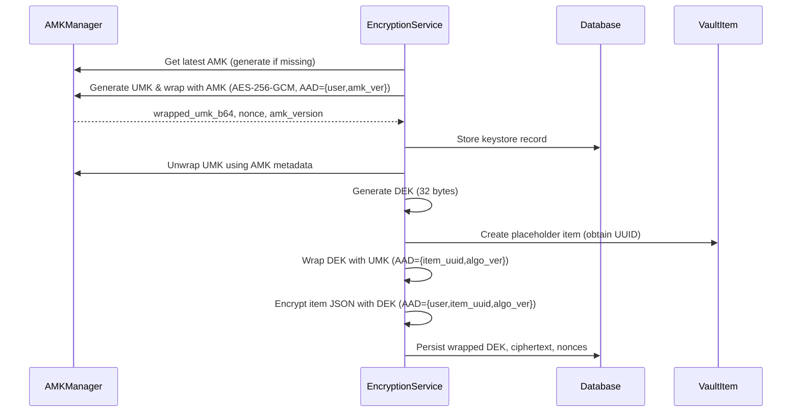

# Encryption Architecture Overview

This document describes how the password manager secures user accounts and vault
items. It covers the key hierarchy, encryption workflows, algorithms, and
storage locations used in the current implementation.

## Key Hierarchy

The system relies on a three-tier hierarchy of symmetric keys implemented in
[`vault/crypto_utils.py`](../password_manager/vault/crypto_utils.py).

- **Application Master Key (AMK)** – A 32-byte root key generated by the
  `AMKManager`. It is persisted either in the `.keys/amk.key` file on disk or
  supplied through the `AMK_V1` environment variable for production
  deployments. The manager also supports AMK rotation and caches keys in memory
  for reuse.【F:password_manager/vault/crypto_utils.py†L20-L116】
- **User Master Key (UMK)** – A per-user 32-byte key generated during account
  provisioning. The UMK is wrapped (encrypted) with the AMK using AES-256-GCM
  before being stored in the `accounts_userkeystore` table alongside the
  associated nonce and AMK version metadata.【F:password_manager/vault/encryption_service.py†L22-L70】【F:password_manager/accounts/models.py†L40-L67】
- **Data Encryption Key (DEK)** – A unique 32-byte key generated each time a
  vault item is created or updated. The DEK encrypts the actual vault item
  payload and is itself wrapped with the owning user’s UMK.【F:password_manager/vault/encryption_service.py†L101-L199】

All key material is represented as raw bytes in memory and encoded with Base64
when persisted.

## Algorithms and Authenticated Data

The modern encryption workflows use AES-256 in Galois/Counter Mode (GCM)
through the `cryptography` library’s `AESGCM` implementation. Helper functions
`aead_encrypt` and `aead_decrypt` enforce 32-byte keys, generate 12-byte
nonces, and attach Additional Authenticated Data (AAD) constructed from stable
identifiers such as user IDs, item IDs, algorithm versions, and AMK
versions.【F:password_manager/vault/crypto_utils.py†L118-L215】

AAD is produced by `create_aad`, which serializes a deterministic JSON object
containing the relevant identifiers. The values included depend on the type of
operation:

- UMK wrapping/unwrapping includes the user ID, the algorithm version, and the
  AMK version.【F:password_manager/vault/crypto_utils.py†L177-L205】
- DEK wrapping/unwrapping includes a sentinel user ID (`0`), the item UUID, and
  the algorithm version.【F:password_manager/vault/crypto_utils.py†L207-L249】
- Vault item payload encryption includes the real user ID, the item UUID, and
  the algorithm version.【F:password_manager/vault/crypto_utils.py†L251-L307】

If authentication fails during decryption, `CryptoError` is raised, and detailed
logs capture the failure context. A best-effort `secure_zero` helper attempts to
scrub sensitive keys from memory when workflows finish.【F:password_manager/vault/crypto_utils.py†L216-L403】

## User Encryption Provisioning

When a new account is created, the custom allauth adapter triggers
`EncryptionService.setup_user_encryption`. The service ensures that a keystore
exists for the user, generates a UMK, wraps it with the latest AMK, and stores
all metadata atomically. Existing keystores are updated in place during
rotation. Failures raise `CryptoError` and are logged as encryption events for
monitoring.【F:password_manager/accounts/adapter.py†L6-L44】【F:password_manager/vault/encryption_service.py†L22-L80】

## Vault Item Encryption Workflow

Vault CRUD operations run through `EncryptionService` to ensure consistent key
handling:

1. **Item creation**
   1. Confirm that the user keystore exists (setting it up if necessary).
   2. Unwrap the UMK from the keystore using the stored AMK version.
   3. Generate a fresh DEK and persist a placeholder vault record to obtain the
      item UUID.
   4. Wrap the DEK with the UMK using AES-256-GCM and the item UUID as part of
      the AAD.
   5. Serialize the item payload to canonical JSON, encrypt it with the DEK, and
      store ciphertext and nonce as Base64.
   6. Securely zero the UMK and DEK buffers before returning.【F:password_manager/vault/encryption_service.py†L90-L199】
2. **Item decryption**
   1. Unwrap the UMK using the stored AMK metadata.
   2. Unwrap the DEK with the UMK.
   3. Decrypt the payload with AES-256-GCM and deserialize the JSON back into a
      Python dictionary.
   4. Attempt legacy AAD permutations if decryption fails (to ease migration),
      then scrub key material from memory.【F:password_manager/vault/encryption_service.py†L200-L290】
3. **Item updates** generate a new DEK, re-wrap it, and re-encrypt the payload
   to provide forward secrecy for edited secrets.【F:password_manager/vault/encryption_service.py†L291-L343】

## Legacy Encryption Artifacts

Earlier migrations stored plaintext fields encrypted directly with AES-256 in
CFB mode using a static 32-byte key defined in `vault.fields.SECRET_KEY`. These
model fields have since been removed from `VaultItem`, but the field classes and
utility functions remain to decrypt legacy rows during migration if needed. They
operate by concatenating a random 16-byte IV with the ciphertext and encoding it
using URL-safe Base64.【F:password_manager/vault/utils.py†L1-L30】【F:password_manager/vault/fields.py†L1-L36】【F:password_manager/vault/migrations/0001_initial.py†L1-L28】【F:password_manager/vault/migrations/0003_alter_vaultitem_options_remove_vaultitem_name_and_more.py†L1-L49】

## Sequence Diagram

## Security Considerations

- **Key storage** – Protect the `.keys/amk.key` file with strict filesystem
  permissions (`0o600`) and back it up securely; losing it prevents UMK
  recovery.【F:password_manager/vault/crypto_utils.py†L60-L115】
- **Monitoring** – Dedicated logging channels record successes and failures for
  key operations, helping detect tampering or configuration issues.
- **Memory hygiene** – While `secure_zero` cannot guarantee complete erasure in
  Python, it limits exposure by overwriting buffers and forcing garbage
  collection when possible.【F:password_manager/vault/crypto_utils.py†L308-L403】
- **Legacy cleanup** – Remove or rotate data that still depends on the static
  AES-CFB helper to ensure all secrets benefit from authenticated encryption.
